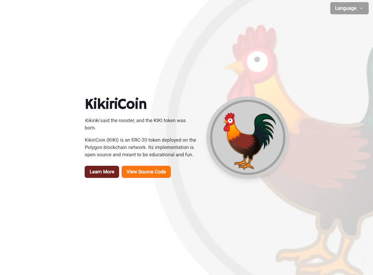

# KikiriCoin Website

<p align="center">
    
</p>
<p align="center">
    Website for presenting the KikiriCoin token and interact with its faucet smart contract.
</p>
<p align="center">
    
</p>
<p align="center" style="font-weight: bold">
    Deployed website: <a target="_blank" href="https://kikiricoin.guillermodlpa.com">https://kikiricoin.guillermodlpa.com</a>
</p>
<p align="center" style="font-weight: bold">
    KikiriCoin smart contracts repository: <a target="_blank" href="https://github.com/guillermodlpa/kikiricoin">https://github.com/guillermodlpa/kikiricoin</a>
</p>

---

## Technologies

The KikiriCoin website is a [NextJS](https://nextjs.org/) application. The UI library is [Charka UI](https://chakra-ui.com/). It uses some libraries for convenience, like [VGLoic/metamask-react](https://github.com/VGLoic/metamask-react). To interact with the Polygon blockchain, we use [Alchemy](https://www.alchemy.com/).

## Development Instructions

You're welcome to clone this repository and play with it as you see fit.

```bash
# Install dependencies
npm install

# Run development server and serve at http://localhost:3000
npm run dev
```

Note that you'll need to populate the `.env.local` file, copying `.env` and populating the blockchain URL of an Alchemy project of yours. For the contract addresses, if you wish to use mine, you can point the env vars to the addresses found in https://kikiricoin.guillermodlpa.com/
